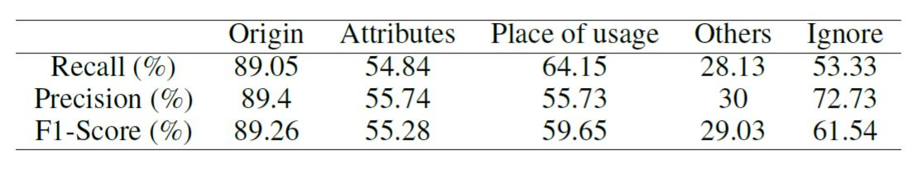
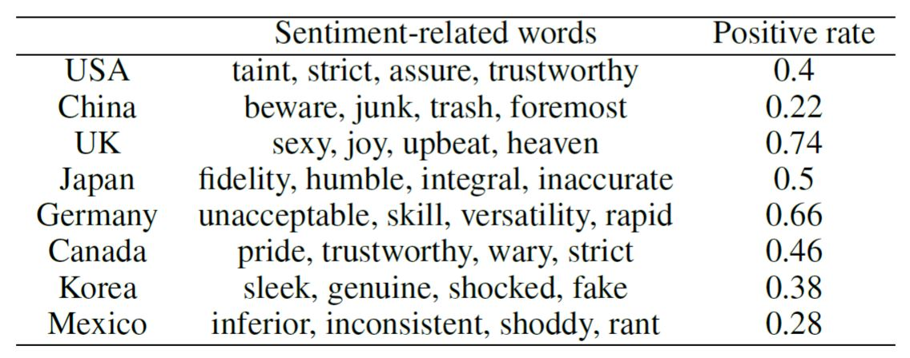

# CS 6471 - Haoliang Jiang, Ruiqi Zhu, Zexing Song

## Online Product Review with Country Information

Code release (updating) for the cs6741 project **Online Product Review with Country Information**, .


**Authors**: [Haoliang Jiang](https://haoliangjiang.github.io), [Ruiqi Zhu](richzhu1997@gmail.com), [Zexing Song](zsong91@gatech.edu).


## Abstract
We study the country information present in online product reviews and we approach the study from two angles. First, we want to examine whether stereotypes occur when reviewers mention country in their reviews. Second, we study whether country information in reviews affect review helpfulness. Furthermore, we explore the motivations behind why reviewers mention countries. We fine-tune a pretrained BERT model based on 3700 manually annotated reviews to classify the reviews and predict the motivation when reviewers mention country. We utilize the Amazon review data and use econometric approach, named entity recognition, bag of words with TF-IDF, word2vec and BERT for processing data and analyzing the results. We identify some preliminary evidence for country stereotypes by looking at word frequency and also the distance between words in the reviews of Amazon U.S. before 2014. We also find that country information in reviews affect review helpfulness. In addition, we demonstrate the probability for using the BERT model to classify reviewer's motivation in mentioning the country-related key words.


## Work
**In summary, our work is three-fold**: 

 * We extract reviews with country of origin information in review text by NER and BERT.
 * We qualitatively identify strong stereotypes for country of origins in review text.
 * We analyze the relationship between country information in review text and review helpfulness.


## Run the code
### Main Requirements
All the codes are tested on colab, a GPU is required.

### Dataset
You can download the raw data from [Amazon Review Dataset 2014](https://jmcauley.ucsd.edu/data/amazon/) or a new version [Amazon Review Dataset 2018](https://nijianmo.github.io/amazon/index.html) and then use the code in process_data_2.ipynb to process the data. Please note that this takes around a week to run NER on all the data. Thus, we recommend you to download the processed data from this [googe drive](https://drive.google.com/drive/folders/1SU4qKSsWON6aDt0fGv4MVKq-AvWV_QrR?usp=sharing).


If you are processing the raw data, please arrange the folder as following:
```
Amazon
├── reviews_$CATEGORY$_5.json
│   ├── reviews_$CATEGORY$_5_all.json
│   │   ├── reviews_$CATEGORY$_5_stats_v2.json
│   │   ├── reviews_$CATEGORY$_5_feat2allinfo.json
│   │   ├── reviews_$CATEGORY$_5_stats.json
│   ├── variables2
│   │   ├── reviews_Amazon_$CATEGORY$_5_varibales.csv
│   ├── bagofwords_new
│   │   ├── data for bagofwords
│   ├── purpose_classification_new
│   │   ├── Ruiqi
│   │   ├── Zexing
│   │   ├── Haoliang
│   │   ├── entire_training
│   │   ├── common_country_sample_idx.json
│   │   ├── global_country2idx.json
│   │   ├── global_country_data.json
│   │   ├── global_country_token.json
│   │   ├── global_country_idx2data.json
│   │   ├── global_country_data2idx.json


```

### Run the code
**With all the data ready, you can run the following notebooks to reproduce the results in our report**:

* BERT_training_application_2.ipynb
* Bagofwords2_2.ipynb
* word2vec2_2.ipynb

## BERT Model


### Our results 
The performance of our BERT model on the annotated dataset


The BOW result


The word2vec result


The t-SNE result


**Note**: 
* We are still working on the repository.
* If there are any questions, please feel free to contact us.